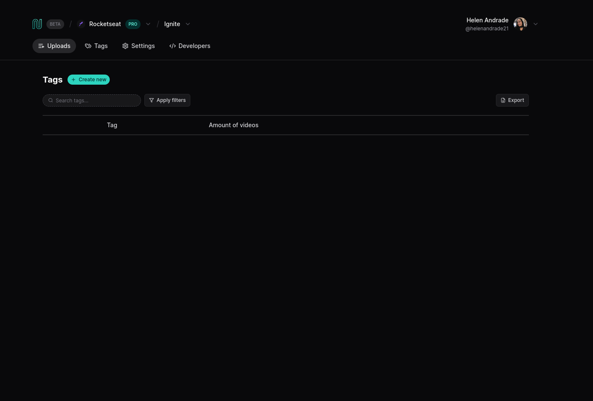
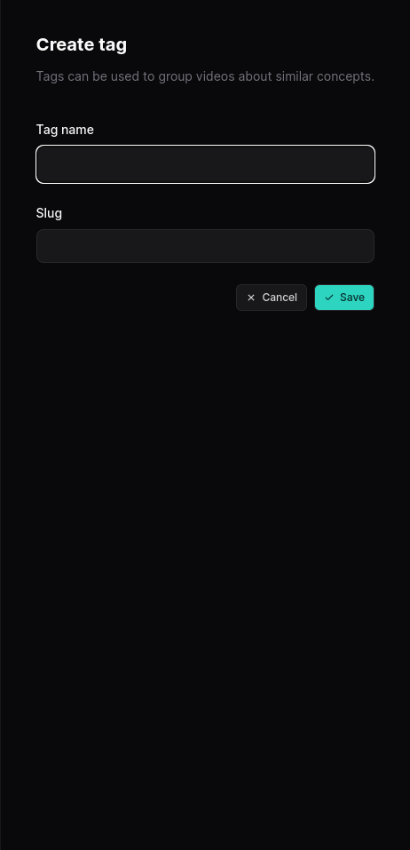

Projeto realizado utilizando React, e para estilização aderi ao Tailwind CSS, um framework de desenvolvimento front-end. Os botões são funcionais e uma api é usada.

  
  

  Feito com ♡ por Helen Andrade

